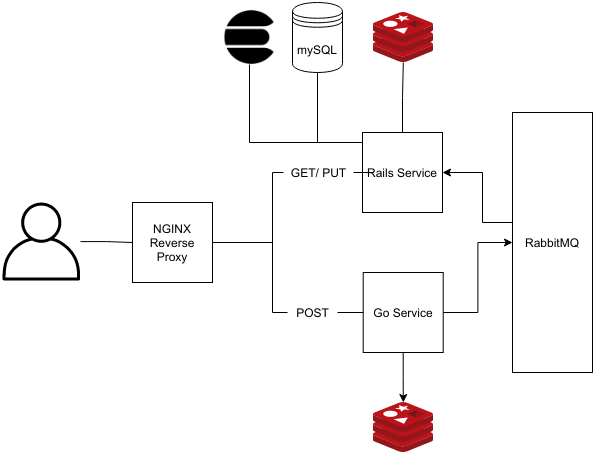

# System Architecture


**note**: in the actual implementation, both go and rails service share the same redis cluster, however, they don't share any keys


# Services
* **rails_service**:
  * **mySQL**: well, a database
  * **rails**: a restful rails api that servers GET/PUT requests
  * **sneakers**: a worker that consumes messages from rabbitMQ of records waiting to be persisted
  * **elasticsearch**: and index to the Messages table
  * **redis**: two hashes populated with the counters that needs to be persisted
  * **whenever(scheduled crons)**: a job that runs every 1 minute to persist the counters into the db and reset them in the cache
* **go_service**:
  * **mux**: an api for creating resources
  * **redis**: hashes to serve resources numbers
  * **rabbitMQ** publishers: publish messages for resources waiting to be processed and persisted
* **reverse_proxy**: an nginx server that acts as a router to the two services above
  
# How to Run
Run `docker-compose up -d`

Ports for all services are forwarded to host for testing purposes, you can comment them and only keep the one for nginx service

Run `docker-compose rails_service exec rspec` to run the tests

# Endpoints
- Create Application
```
# request:

curl --location --request POST 'http://localhost:80/api/applications' \
--header 'Content-Type: application/json' \
--data-raw '{
    "application_name": <APP_NAME>
}'

# response:

{
    "type": "application",
    "application_token": "2a3bbac-456e-4rf6-...",
    "application_name": "myname"
}      
```


- Create Chat
```
# request:

curl --location --request POST 'http://localhost:80/api/applications/<APP_TOKEN>/chats' \
--header 'Content-Type: application/json' \
--data-raw '{
    "chat_name": <CHAT_NAME>
}'

# response:

{
    "type": "chat",
    "application_token": "2a7b3bbd-45e2-4eff-...",
    "chat_number": 2,
    "chat_name": "mychatname"
}
```

- Create Message
```
# request:

curl --location --request POST 'http://localhost:80/api/applications/<APP_TOKEN>/chats/<CHAT_NUMBER>' \
--header 'Content-Type: application/json' \
--data-raw '{
    "application_name": <APP_NAME>
}'

# response:

{
    "type": "message",
    "application_token": "2a7b3bbd-45e2-4eff-b7cd-...",
    "chat_number": 1,
    "message_number": 1,
    "message_content": "hello world!"
}
```

- Search Chat Messages
```
# request:

curl --location --request GET 'http://localhost:80/api/applications/<APP_TOKEN>/chats/<CHAT_NUMBER>/search' \
--header 'Content-Type: application/json' \
--data-raw '{
    "search_query" : <SEARCH_QUERY>
}'

# response:

[
    {
        "number": 1,
        "content": "hello world!"
    },
    ...
]
```

- Supported endpoints:
```
# applications
GET   /api/applications                      
GET   /api/applications/:token
PATCH /api/applications/:token
PUT   /api/applications/:token

# chats
GET   /api/applications/:app_token/chats        
GET   /api/applications/:app_token/chats/:number
PATCH /api/applications/:app_token/chats/:number
PUT   /api/applications/:app_token/chats/:number
GET   /api/applications/:app_token/chats/:chat_number/search

# messages
GET   /api/applications/:app_token/chats/:chat_number/messages
GET   /api/applications/:app_token/chats/:chat_number/messages/:number
PATCH /api/applications/:app_token/chats/:chat_number/messages/:number
PUT   /api/applications/:app_token/chats/:chat_number/messages/:number
```